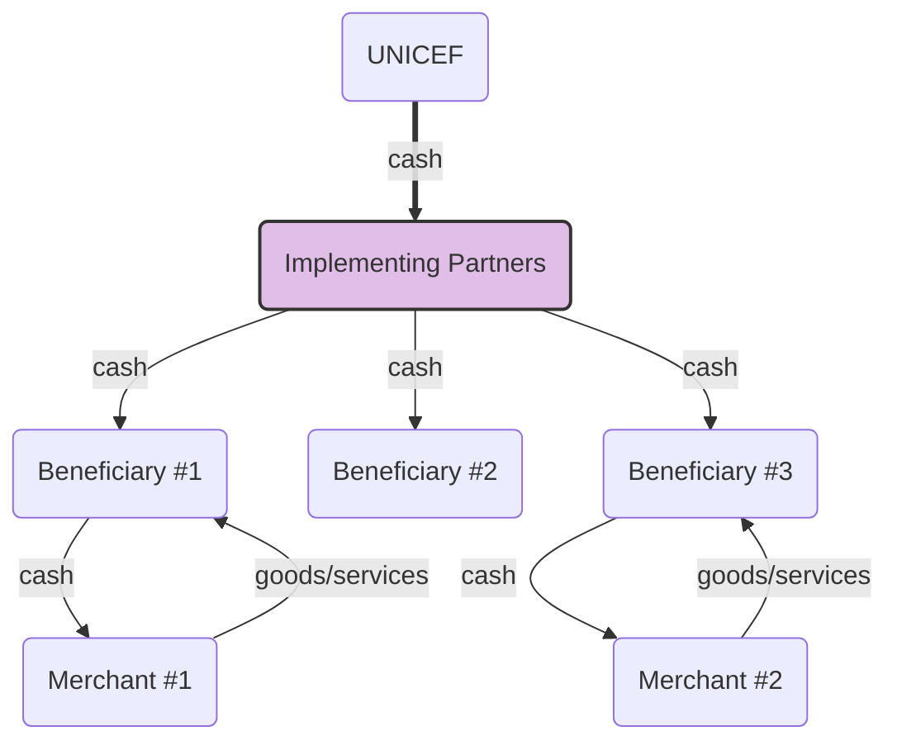

# unicef-innovation-challenge
UNICEF Innovation Challenge

## The Challenge

> A system for tracking, managing, auditing, and reporting activities involved in humanitarian cash transfers.

## Software Architecture

The ecosystem consists of:

- **UNICEF** - The main provider of cash.
- **Implementing Partners (IPs)** - Request and disburse the cash, keep a record of who received it, how the money is spent, etc.
- **Beneficiaries** - Individuals who receive cash to spend.
- **Merchants** - Provide goods/services in exchange for cash.

### Implementing Partners (IPs) - Prototype

This repository contains a prototype of the _Implementing Partners (IPs)_ component, with the following supported features:

1. IP receives the funds from UNICEF.
1. IP distributes the funds, while maintaining a detailed record of expenditure.
1. Direct distribution of funds to beneficiaries.
